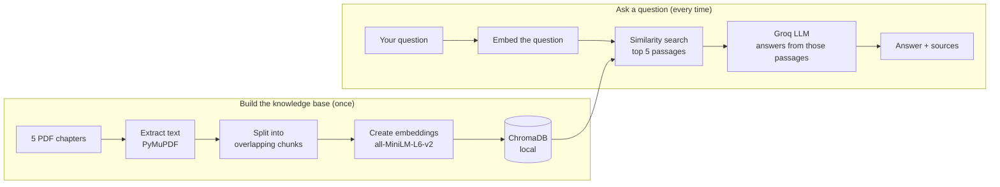

<div align="center">

# Study Assistant

**Ask questions about your Python chapters and get answers grounded in your own PDFs, with the exact pages they came from.**


<br>


</div>

<br>

## What it does

Study Assistant is a Retrieval-Augmented Generation (RAG) app. You give it five PDF chapters. It reads them, turns every passage into a vector, and stores those vectors locally in ChromaDB. When you ask a question, it finds the most relevant passages and sends **only those** to a Groq-hosted language model, which writes the answer.

Because the model is told to answer from your chapters alone, you get explanations that match your course material. Every answer lists the chapters and pages it was taken from, so you can check it.

## Features

| | |
|---|---|
| **Grounded answers** | The model answers only from retrieved passages. If your chapters don't cover the question, it says so instead of guessing. |
| **Source cards** | Each answer shows the chapter, page and a match score for every passage used. |
| **Local vector database** | Embeddings are created on your machine and saved in ChromaDB. Only the retrieved passages are sent to Groq. |
| **Guided setup** | A three-step sidebar walks you through adding chapters, building the knowledge base and asking questions. |
| **Readable replies** | Answers render with lists, inline code and Python code blocks with a Copy button. |
| **Light and dark themes** | Follows your system setting and remembers your choice. |
| **Works on phones** | The setup panel becomes a slide-out drawer on small screens. |
| **Keyboard friendly** | Enter sends, Shift+Enter adds a new line, visible focus states, and reduced-motion support. |

## Preview

<table>
<tr>
<td width="62%"></td>
<td width="38%"></td>
</tr>
<tr>
<td align="center"><sub>Dark theme</sub></td>
<td align="center"><sub>Mobile layout</sub></td>
</tr>
</table>

> The previews use sample answers so the layout can be shown without an API key.

## How it works



1. **Extract.** PyMuPDF reads each PDF page by page, so every passage keeps its file name and page number.
2. **Chunk.** Text is split into pieces of about 900 characters with a 150-character overlap, so ideas that cross a boundary aren't cut in half.
3. **Embed.** The `all-MiniLM-L6-v2` sentence-transformer turns each chunk into a vector. This runs locally.
4. **Store.** Vectors, text and metadata are saved in a persistent ChromaDB collection using cosine distance.
5. **Retrieve.** Your question is embedded the same way, and the closest passages are returned.
6. **Generate.** Groq receives the question plus those passages and a strict system prompt, then writes a student-friendly answer.

## Quick start

You need **Python 3.10 or newer** and a free [Groq API key](https://console.groq.com/keys).

### 1. Get the project

```bash
cd AI_Study_Assistant_RAG
```

### 2. Create a virtual environment

macOS / Linux:

```bash
python3 -m venv .venv
source .venv/bin/activate
```

Windows (PowerShell):

```powershell
python -m venv .venv
.venv\Scripts\activate
```

### 3. Install dependencies

```bash
pip install -r requirements.txt
```

The first run downloads the embedding model (roughly 90 MB), so it can take a minute.

### 4. Add your API key

macOS / Linux:

```bash
cp .env.example .env
```

Windows (PowerShell):

```powershell
Copy-Item .env.example .env
```

Open `.env` and replace `your_groq_api_key_here` with your key. Never commit this file. It is already listed in `.gitignore`.

### 5. Run it

```bash
uvicorn app.main:app --reload
```

Open **http://127.0.0.1:8000**.

## Using the app

1. **Add your chapters.** Drop exactly five PDFs on the sidebar (or click to browse), then choose **Upload PDFs**. You can add files in batches and remove any with the ✕.
2. **Build the knowledge base.** Choose **Build knowledge base**. The four stages show their results when the build finishes: pages read, passages created, embeddings made, database saved.
3. **Ask questions.** Type your own, or pick a starter. Try:
   - *What are Python variables?*
   - *Explain how a for loop works.*
   - *How do I define and call a function?*
   - *When should I use if, elif and else?*

Uploading a new set of PDFs replaces the previous set, and building the knowledge base replaces the previous index.

### Try it without uploading

The project ships with five sample chapters in `data/pdfs/`. Index them from the command line:

```bash
python ingest.py
```

Then start the server. The app detects the existing index and opens ready to answer questions.

## Configuration

All settings live in `.env`. Only `GROQ_API_KEY` is required.

| Variable | Default | What it controls |
|---|---|---|
| `GROQ_API_KEY` | none | Your Groq key. Without it, questions fail with a clear error in the chat. |
| `GROQ_MODEL` | `openai/gpt-oss-120b` | The Groq model that writes answers. |
| `EMBEDDING_MODEL` | `all-MiniLM-L6-v2` | The sentence-transformer used for embeddings. |
| `CHUNK_SIZE` | `900` | Characters per chunk. |
| `CHUNK_OVERLAP` | `150` | Characters shared between neighbouring chunks. |
| `TOP_K` | `5` | Default number of passages retrieved per question. |

If you change `EMBEDDING_MODEL`, `CHUNK_SIZE` or `CHUNK_OVERLAP`, rebuild the knowledge base so the stored vectors match.

### Tuning tips

- **Answers feel vague or off-topic:** lower `CHUNK_SIZE` (try `600`) so each passage is more focused.
- **Answers miss context:** raise `CHUNK_OVERLAP` or `TOP_K`.
- **Chapters are long and dense:** raise `CHUNK_SIZE` (try `1200`) and keep a healthy overlap.

## API reference

The web page uses a small JSON API, which you can also call directly. Interactive docs are at **http://127.0.0.1:8000/docs**.

| Method | Path | Purpose |
|---|---|---|
| `GET` | `/` | The web interface. |
| `GET` | `/api/health` | Service status and index statistics. |
| `GET` | `/api/stats` | Chunk count, collection name, embedding model, database path. |
| `POST` | `/api/upload` | Upload PDFs as multipart form field `files`. Replaces earlier uploads. |
| `POST` | `/api/index` | Build the knowledge base from the uploaded PDFs. Requires exactly five. |
| `POST` | `/api/query` | Ask a question. |

Example query:

```bash
curl -X POST http://127.0.0.1:8000/api/query \
  -H "Content-Type: application/json" \
  -d '{"question": "What is a for loop?", "top_k": 5}'
```

Response:

```json
{
  "answer": "A for loop repeats a block of code once for each item in a sequence...",
  "sources": [
    { "source": "chapter_04_loops.pdf", "page": 1, "distance": 0.3124 }
  ]
}
```

`distance` is cosine distance, so lower means a closer match. The interface shows it as a percentage (`1 - distance`). `top_k` is limited to values from 1 to 10.

## Project structure

```text
AI_Study_Assistant_RAG/
├── app/
│   ├── main.py            FastAPI routes and static file serving
│   ├── rag_service.py     Ties extraction, chunking, search and answering together
│   ├── pdf_processor.py   PyMuPDF page extraction and overlapping chunker
│   ├── vector_store.py    ChromaDB collection and sentence-transformer embeddings
│   ├── groq_service.py    Prompt construction and the Groq chat call
│   └── config.py          Paths and environment settings
├── templates/
│   └── index.html         Page structure
├── static/
│   ├── style.css          Design tokens, layout, themes, responsive rules
│   └── app.js             Upload flow, build progress, chat, answer rendering
├── data/
│   ├── pdfs/              Five sample chapters for ingest.py
│   └── uploads/           PDFs uploaded through the interface
├── chroma_db/             Local vector database (created automatically)
├── docs/                  README images
├── ingest.py              Index the sample PDFs from the command line
├── requirements.txt
└── .env.example
```

## Tech stack

| Layer | Tools |
|---|---|
| Backend | FastAPI, Uvicorn, Jinja2 |
| PDF parsing | PyMuPDF |
| Embeddings | Sentence Transformers (`all-MiniLM-L6-v2`) |
| Vector database | ChromaDB (persistent, cosine similarity) |
| Language model | Groq API |
| Frontend | Plain HTML, CSS and JavaScript with no build step |

## Troubleshooting

**"GROQ_API_KEY is missing"** appears in the chat.
Add your key to `.env` and restart the server.

**"Please upload exactly 5 PDF files"**
The knowledge base is built from five files. Remove or add files until the sidebar shows 5 of 5, then upload again.

**The build seems stuck on the first run.**
The embedding model is downloading. Check your internet connection and wait a minute.

**Answers say "I could not find enough information in the uploaded chapters."**
Your question isn't covered by the indexed text. Rephrase it, or check that your PDFs contain selectable text.

**A PDF produces zero passages.**
It is probably a scan made of images. OCR isn't included, so use a PDF with real, selectable text.

**The page looks unstyled.**
Open the app through `uvicorn` at `http://127.0.0.1:8000` rather than opening `index.html` as a file, because the styles and script are served from `/static`.

## Limitations

- OCR for scanned PDFs isn't included.
- The interface expects exactly five PDFs (the sample set is five chapters).
- Each question is answered independently, with no memory of earlier questions in the same chat.
- Answers appear when they are fully generated. They don't stream word by word.

## Ideas for next steps

- Stream answers as they are written
- Show the retrieved passage text inside each source card
- Follow-up questions that remember the conversation
- OCR for scanned chapters
- Support any number of PDFs and other file types

## Publishing to GitHub

Check that `.env` and `chroma_db/` are ignored, then:

```bash
git init
git add .
git commit -m "Study Assistant: RAG over Python chapters"
git branch -M main
git remote add origin YOUR_GITHUB_REPOSITORY_URL
git push -u origin main
```

## Sample content

The PDFs in `data/pdfs/` are original sample Python notes made for testing. Replace them with any educational Python PDFs you like.
